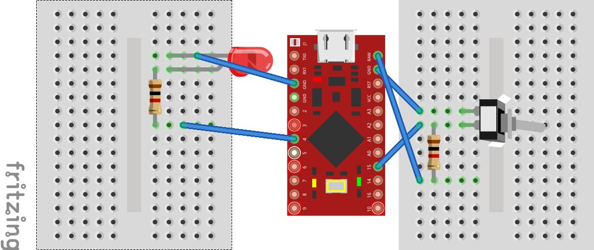

# ffxiv-ps4-macro-keyboard-by-pro-micro

PS4で自動制作したいという思い、ツールを自作することにしました。  
***PS4からしたらキーボード入力でしかないとはいえ、外部ツール扱いになると思うので自己責任でお願いします。***  

参考: [FF14 外部ツールについて運営側のスタンスを改めて説明 | うさねこ散歩](http://next-innovation-fuk.com/2020/02/09/ff14-%e5%a4%96%e9%83%a8%e3%83%84%e3%83%bc%e3%83%ab%e3%81%ab%e3%81%a4%e3%81%84%e3%81%a6%e9%81%8b%e5%96%b6%e5%81%b4%e3%81%ae%e3%82%b9%e3%82%bf%e3%83%b3%e3%82%b9%e3%82%92%e6%94%b9%e3%82%81%e3%81%a6/)

## 前提条件
### Pro Micro等
ボードの構成はこんな感じです。

- Pro Micro (3.3V)
- トグルスイッチ (On-Off 2pin)
- 抵抗1kΩ 2個
- 発光ダイオード

Arduinoを使って実装してます。  
Arduino IDEではBoardとして`Arduino Micro`を選択してください。

### クラフター装備
エースセチック装備を禁断していること前提のマクロを使用しています。

私はこちらのサイトを参考に禁断を行いました。  
[【FF14】5.3で追加されたクラフターの新式装備の禁断例！エースセチック装備 |](https://portfolio-navigation.com/%E3%80%90ff14%E3%80%915-3%E3%81%A7%E8%BF%BD%E5%8A%A0%E3%81%95%E3%82%8C%E3%81%9F%E3%82%AF%E3%83%A9%E3%83%95%E3%82%BF%E3%83%BC%E3%81%AE%E6%96%B0%E5%BC%8F%E8%A3%85%E5%82%99%E3%81%AE%E7%A6%81%E6%96%AD)

## ツール群
### スモークチキン ([smoked_chicken](smoked_chicken/smoked_chicken.ino))
スモークチキンHQを目指すマクロを自動で実行していきます。  
マクロは[こちら](https://ffxivteamcraft.com/simulator/31901/34569/aXJw2T3AydwYvlm5r6Uw?stats=2822/2783/569/80/1&food=30482,1&med=27959,1)

注意点は以下の２つです。
- マイスターで制作を行っています。
- 地鶏のモモ肉は１つだけHQを使用しています。
- チリクラブHQと魔匠の水薬HQを使用してます。
